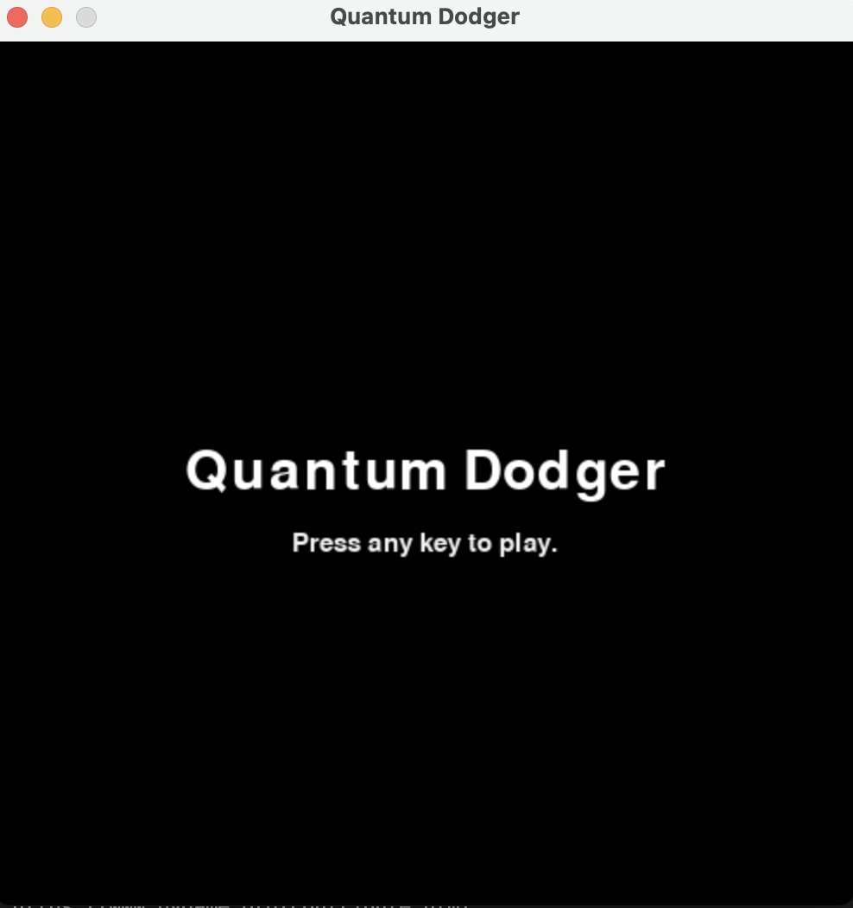
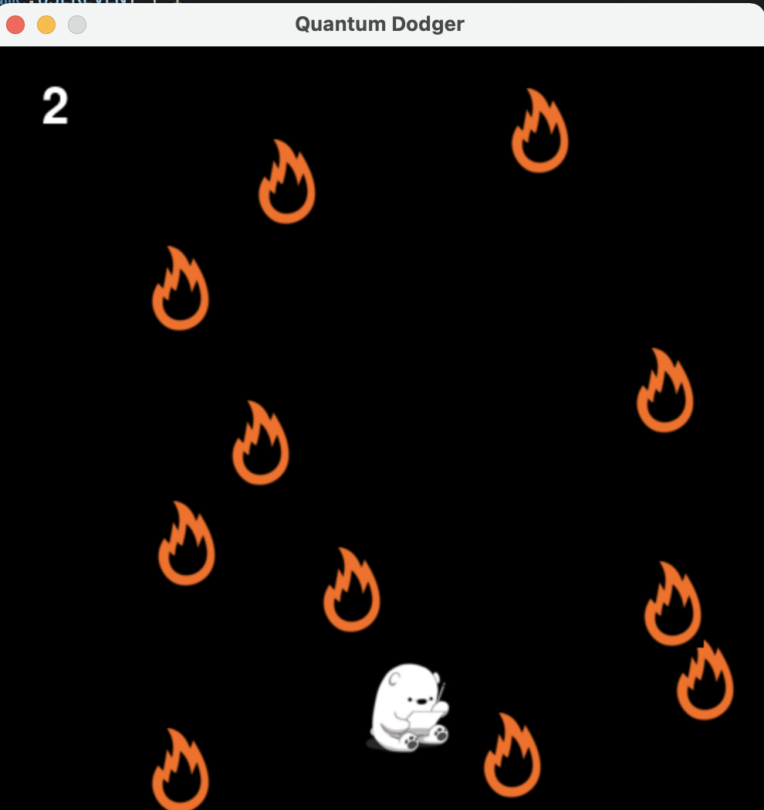
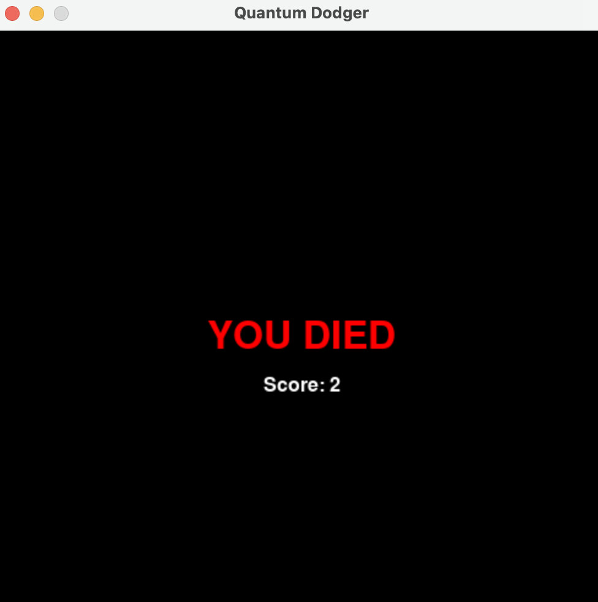

# Quantum Dodger
* Names: Alejandro Ortiz, Eric Choi, Austin Yang, Cian Gonzales
* Team Name: IT Squad

## Description of Problem and Overview of Solution
The problem we decided to address using Qiskit was randomness. Regular pauli gates like the x, y, and z gates perform operations on qubits; however their effects are no different from applying logic gates to a bit from a classical computer. Classical computers can only compute pseudo-random numbers using a definite computational process. A set of values from pseudorandom would be statistically random; however, it is derived from a known starting point. The nature of qubits is based on randomness. The Hadamard gate places a qubit in a state of superposition with equal probability of the qubit being spin up or spin down when measured. Quantum randomness, unlike classical randomness, is based on true randomness that exists in nature. While classical pseudo-randomness depends on deterministic quantities to get a random result, quantum randomness uses a true random process to get a random result achieving true randomness. 

For our project, we decided to implement the random number generator algorithm into a simple 2D dodging game, called Quantum Dodger. The user would attempt to avoid a series of enemies that are randomly scattered around in a square grid each moving at a random speed in a random direction. We utilized quantum randomness to determine the position of the enemies and the velocity vector. We also implemented sprites and an in-game soundtrack that was developed within the team. Our team hoped to apply Quantum Computers in such a way where the end product is both practical and fun.

## Screenshots of Game
<table>
  <tr>
    <td>Title Screen</td>
     <td>Game Screenshot</td>
     <td>End Screen</td>
  </tr>
  <tr>
    <td></td>
    <td></td>
    <td></td>
  </tr>
 </table>

## Citations
* [Quantum RNG Source] https://github.com/qiskit-community/qiskit-community-tutorials/tree/master/Cryptography
* [PyGame Source] https://realpython.com/pygame-a-primer/
* Special Shoutout to Yokai for developing Quantum Dodger's soundtrack
